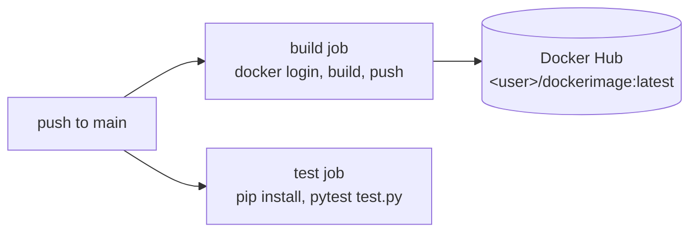

# Flask CI/CD Demo with GitHub Actions and Docker Hub

A minimal Flask service used to practise a CI/CD pipeline: every push to `main` runs the test suite with pytest and builds and pushes a Docker image to Docker Hub.


## Pipeline



| File | Purpose |
|---|---|
| `app.py` | Flask app, `GET /` returns `Hello World!` on port 8080 |
| `test.py` | pytest fixture with Flask's test client; asserts status 200 and response body |
| `requirements.txt` | `flask>=2.0,<3.0`, `werkzeug==2.0.3` |
| `Dockerfile` | `python:3.8` image running `app.py` |
| `.github/workflows/main.yml` | `build` and `test` jobs; Docker Hub credentials from `DOCKERHUB_USERNAME` / `DOCKERHUB_TOKEN` secrets |

## Run locally

```bash
pip install -r requirements.txt
python app.py                      # http://localhost:8080
pytest test.py

docker build -t flask-cicd-demo .
docker run -p 8080:8080 flask-cicd-demo
```

## Improvements I would make next

- Make `build` depend on `test` (`needs: test`) so a failing test blocks the image push.
- Tag images with the commit SHA as well as `latest`.
- Install from `requirements.txt` in the Dockerfile and move to `python:3.12-slim` (3.8 is end-of-life).
- Update `actions/checkout`, `setup-python` and `docker/login-action` to current major versions.

## Credits

Started from a CI/CD tutorial repository by [@N4si](https://github.com/N4si) (commits from September 2023 in the history). My changes (November 2024) updated the pipeline, image name and dependency versions.
